# Week-14-Algorithmic-Trading

The program aims to look at data from market performance and devise a automated strategy based on patterns, algorithms, and comparing short term and longterm returns. The program utilizes machine learning technonolgy to understand the existing patterns from the train models to predict the test model.The program also uses different supervized machine learning methods to predict buying and selling of equity.

---

## Technology

The program was written on a JupyterLab and utlizes python 3.7 as the programming language. The program utlizes different features and functions ooffered by Scikit Learn to utilize machine learning technology.

The following imports of libraries and functions are necessary for the program to run:

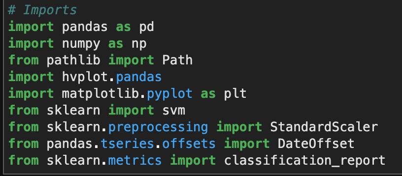

---

First we use pandas to manipulate the data to suite our requirement. We also silce components of our data into new dataframes.

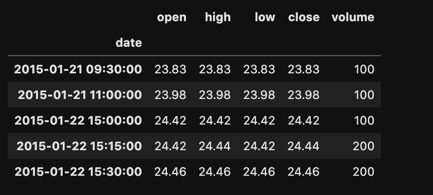
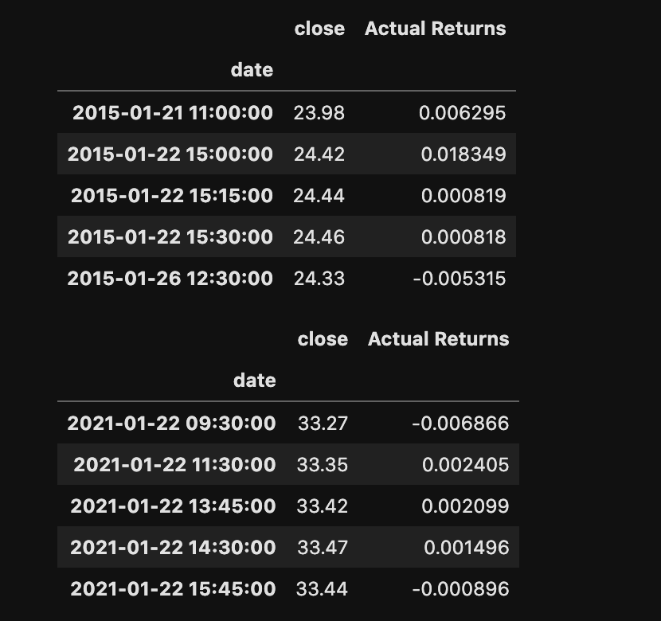

We calculate Simple Moving Averages for different estimates of timeframes. These different timeframes allows us to estimate means in between long-run and short-run. A higher short-run average compared to a long-run average suggests a uptrend, or a buy signal, and vice versa. 
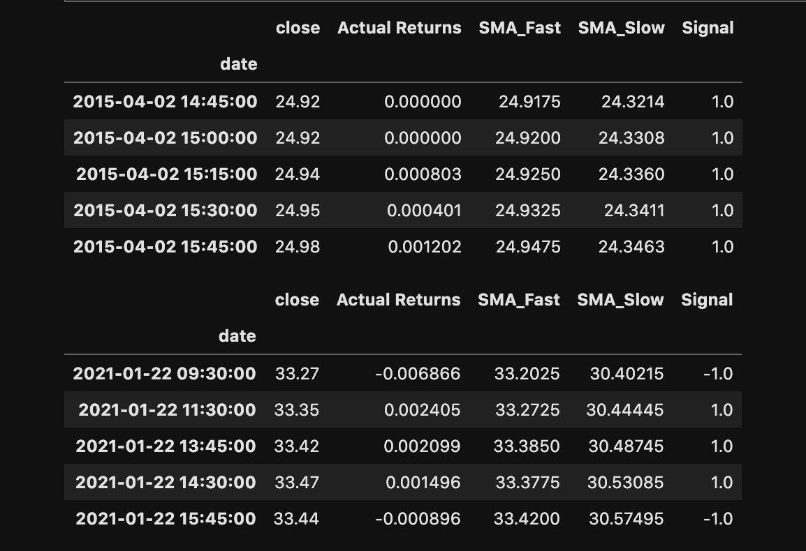
1[short vs long](./images/shortvslong.png)
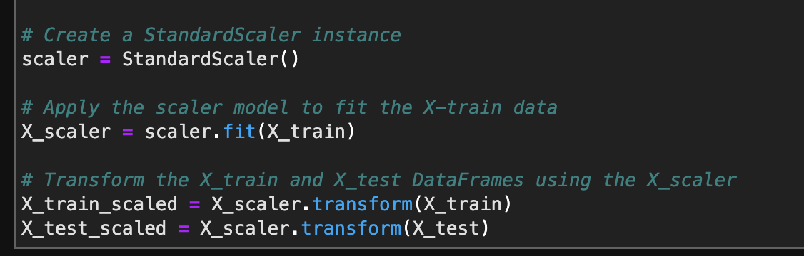
Based on such contrasts we can draw different signals(buy/sell). Similarly, these comparisons would also be used as references for the testing and training of the target and features. 

In the program, we used two different supervised machine learning methods to see if the efficieny measures differ between them. The dataset is divided into training set and test set.
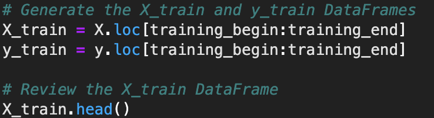
We use Sklearn's train_test_split to create data sets.

First we use SVM(Support Vector Machines) to make predictions

We call, fit, and predict the data.

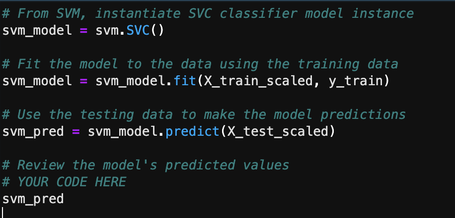
We can take a look into how efficient was our prediction.
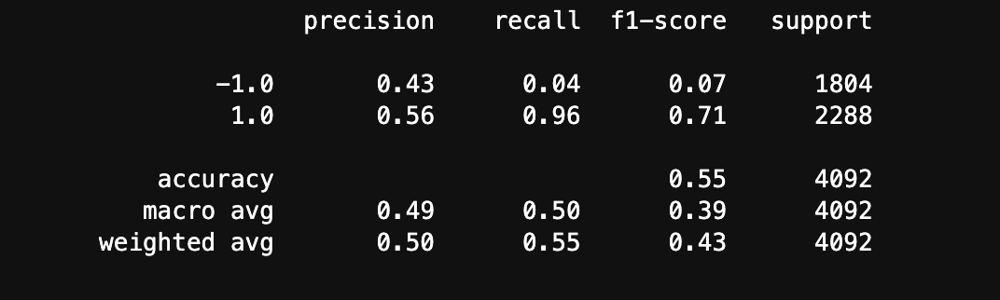

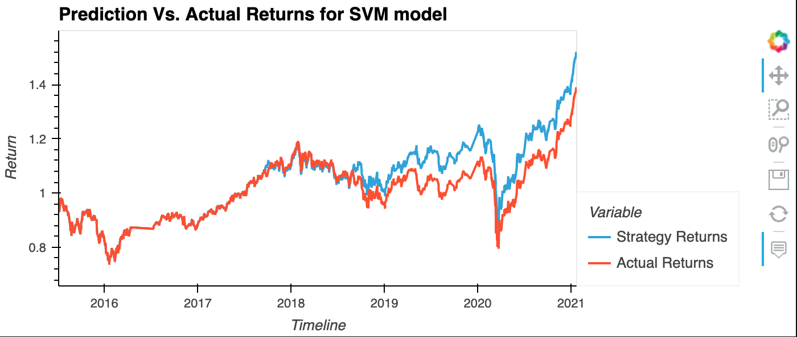

Second, we used DecisionTreeClassifier and repeat the process.

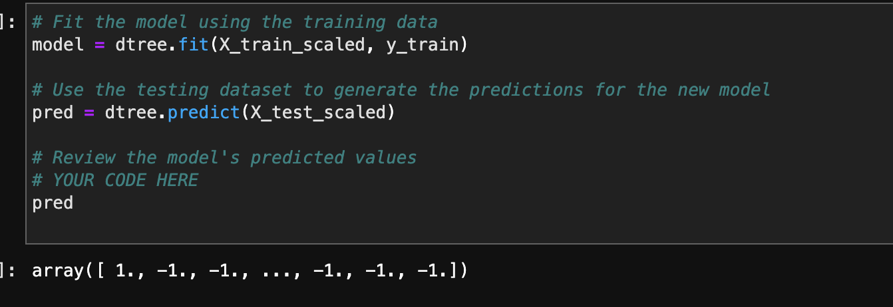
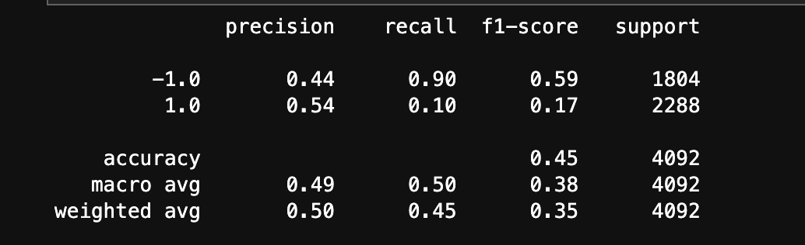
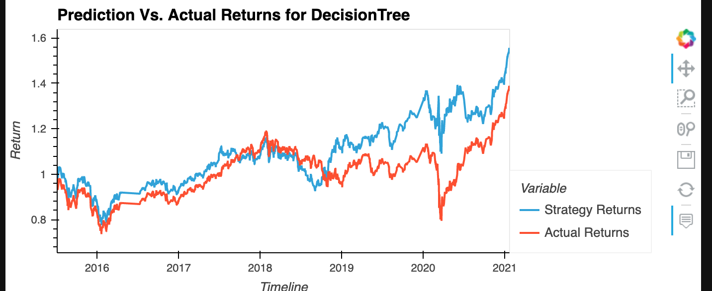

---
## Analysis:

In between the two supervised machine learning methods, SVM had better recall efficiency, while the opposite was true for the predictions by DecisionTreeClassification. Overall efficiency was better for the SVM model whereas the statistics for efficiency as represented by precision was constant for both. While the overall measure of accuracy for SVM was 0.55, which is above the benchmark of 0.5, decission tree had only 0.45. Decision Tree is prone to overfitting, and this might be a case for this instance.

---

Babin Shrestha

